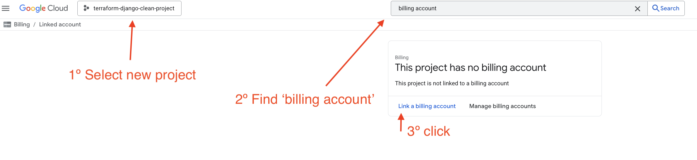
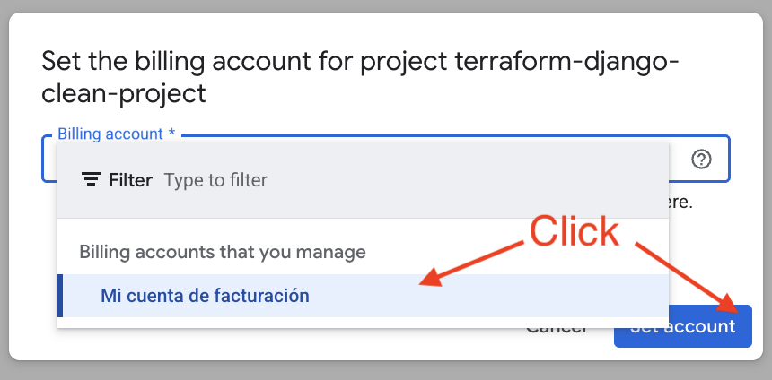
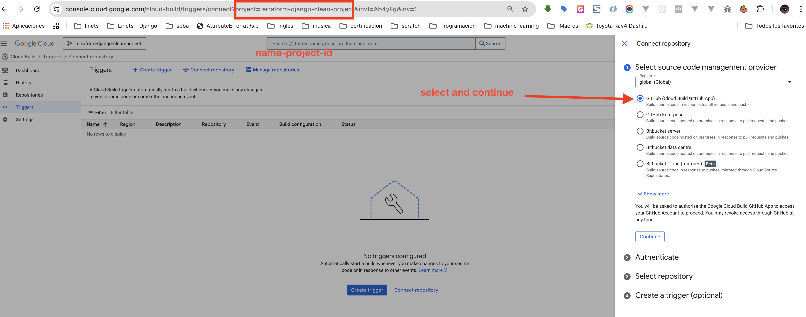
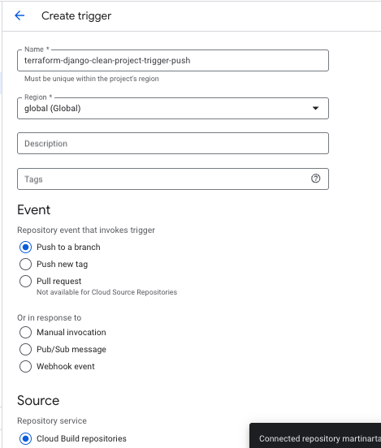

# 🚀 Django on Cloud Run

## Despliegue Automático con Terraform

Despliega automáticamente un proyecto Django **casi completamente limpio** en Google Cloud Run usando Terraform y Cloud Build.

**Características del proyecto Django:**
- ✅ Django 5.2.5 con configuración mínima
- ✅ Admin de Django funcional
- ✅ Archivos estáticos con WhiteNoise
- ✅ Superuser creado automáticamente
- ✅ CSRF configurado para Cloud Run
- ✅ **Base de datos SQLite** (temporalmente)
- ✅ Sin apps adicionales, solo Django core

---

## 🚀 Primer Deploy (Sin Configuración Previa)

**¡Importante!** Este proyecto está configurado para funcionar desde el primer deploy sin necesidad de conocer la URL del servicio de antemano.

**Proceso simplificado:**
1. Configurar Google Cloud (facturación, APIs, etc.)
2. Ejecutar `terraform apply -auto-approve`
3. **Obtener la URL** (se genera aunque el servicio no esté funcionando):
   ```bash
   terraform output
   ```
4. **Actualizar la URL en `django-app/config/settings.py`** (si es diferente a las pre-configuradas)
5. **Rebuild y redeploy:**
   ```bash
   cd django-app && gcloud builds submit --config=cloudbuild.yaml .
   cd .. && terraform taint google_cloud_run_service.django && terraform apply -auto-approve
   ```
6. ¡Listo! El admin de Django ya funciona

---

## 📁 Estructura del Proyecto

```
django-on-cloud-run/
├── main.tf                 # Configuración principal de Terraform
├── variables.tf            # Definición de variables
├── outputs.tf              # Salidas del despliegue
├── terraform.tfvars        # Valores de las variables
├── terraform.tfvars.example # Ejemplo de variables
├── django-app/             # Aplicación Django
│   ├── config/             # Configuración de Django
│   │   ├── settings.py     # Configuración principal
│   │   ├── urls.py         # URLs del proyecto
│   │   └── wsgi.py         # WSGI application
│   ├── manage.py           # Script de gestión
│   ├── requirements.txt    # Dependencias Python
│   ├── Dockerfile          # Imagen Docker
│   └── cloudbuild.yaml     # Configuración de Cloud Build
└── README.md               # Este archivo
```

---

## 🧱 Requisitos

- Google Cloud SDK (`gcloud`)
- Terraform >= 1.3
- Cuenta de Google Cloud con facturación habilitada

---

## 🚀 Iniciar proyecto en GCP

```bash
gcloud init
gcloud projects create django-project --name="Django Project"
gcloud config set project django-project
```

### ⚠️ Importante: Configurar Cuenta de Facturación

**Después de crear el proyecto, es necesario relacionarlo con una cuenta de facturación. Este paso es inevitable y debe realizarse manualmente desde la consola de Google Cloud.**

1. Ve a la [Consola de Google Cloud](https://console.cloud.google.com/)
2. Selecciona tu proyecto `django-project`
3. Navega a **Facturación** en el menú lateral
4. Haz clic en **Vincular cuenta de facturación**
5. Selecciona una cuenta de facturación existente o crea una nueva




### 🔧 Habilitar APIs de Google Cloud

Una vez configurada la cuenta de facturación, habilita las APIs necesarias:

```bash
gcloud services enable \
  run.googleapis.com \
  artifactregistry.googleapis.com \
  sqladmin.googleapis.com \
  secretmanager.googleapis.com \
  compute.googleapis.com \
  iam.googleapis.com \
  cloudbuild.googleapis.com \
  servicenetworking.googleapis.com
```

### 🔗 Conectar Google Cloud Build con GitHub

**Este paso es necesario una vez por proyecto para permitir que Cloud Build acceda a tu repositorio de GitHub.**

1. Ve a la [Consola de Cloud Build](https://console.cloud.google.com/cloud-build/triggers/connect?project=terraform-django-clean-project)
   - Reemplaza `terraform-django-clean-project` con el ID de tu proyecto
2. Sigue las instrucciones para conectar tu cuenta de GitHub
3. Autoriza el acceso a los repositorios que necesites



**Nota:** Esta configuración se realiza una sola vez por proyecto y permite que Cloud Build acceda automáticamente a tus repositorios de GitHub para futuros despliegues.

### 🚀 Crear Trigger de Cloud Build

**Después de conectar GitHub, necesitas crear un trigger para automatizar los builds.**

#### Opción 1: Desde la Consola Web (Recomendado)
1. Ve a [Cloud Build Triggers](https://console.cloud.google.com/cloud-build/triggers)
2. Haz clic en **"Crear trigger"**
3. Configura el trigger con:
   - **Nombre**: `terraform-django-clean-project-trigger-push`
   - **Evento**: `Push to a branch`
   - **Repositorio**: Tu repositorio de GitHub
   - **Rama**: `^main$`
   - **Archivo de configuración**: `cloudbuild.yaml`
   - **Service Account**: Selecciona la cuenta de servicio automática (ej: `123456789-compute@developer.gserviceaccount.com`)




### 🚀 Despliegue Completo

**El despliegue se realiza en dos fases: primero crear todo el entorno, luego activar el build.**

#### Fase 1: Crear Todo el Entorno en la Nube
```bash
terraform init
terraform plan
terraform apply -auto-approve
```

**✅ En esta fase se crea:**
- Base de datos PostgreSQL
- Secretos de Django
- Artifact Registry
- Cloud Run (con imagen temporal)
- Todas las APIs necesarias

#### Fase 2: Activar Build y Actualizar Imagen
1. **Haz un push a tu repositorio** para activar el build automático:
   ```bash
   git add . && git commit -m "Trigger build" && git push
   ```

2. **Espera a que el build termine** (puedes verlo en [Cloud Build](https://console.cloud.google.com/cloud-build/builds))

3. **Actualiza Cloud Run con la imagen real**:
   ```bash
   # Edita main.tf y cambia la imagen temporal por la real:
   # image = "gcr.io/cloud-builders/docker:latest"
   # por:
   # image = "us-central1-docker.pkg.dev/${var.project_id}/django-repo/django:latest"
   
   terraform apply -auto-approve
   ```

4. **Obtén la URL del servicio**:
   ```bash
   terraform output
   ```

**🌐 Tu aplicación Django estará disponible en la URL mostrada**

**Nota:** El primer despliegue usa una imagen temporal. Después del build, se actualiza con la imagen real de Django.

---

## 🗄️ Base de Datos

**Actualmente el proyecto usa SQLite** para simplicidad. La base de datos se crea automáticamente en el contenedor.

**Para cambiar a PostgreSQL en el futuro:**
1. Modificar `django-app/config/settings.py` para usar PostgreSQL
2. Agregar `psycopg2-binary` a `requirements.txt`
3. Configurar las variables de entorno en `main.tf`

---

## ⚙️ Configuraciones Importantes

### CSRF Trusted Origins

**Para el primer deploy:** Las URLs están pre-configuradas en `django-app/config/settings.py` y funcionarán automáticamente.

**Si la URL del servicio cambia después del primer deploy:**

1. **Obtener la nueva URL:**
   ```bash
   terraform output
   ```

2. **Actualizar `django-app/config/settings.py`:**
   ```python
   CSRF_TRUSTED_ORIGINS = [
       'https://tu-nueva-url.run.app',
       'https://tu-nueva-url-alternativa.run.app',
   ]
   ```

3. **Rebuild y redeploy:**
   ```bash
   cd django-app && gcloud builds submit --config=cloudbuild.yaml .
   cd .. && terraform taint google_cloud_run_service.django && terraform apply -auto-approve
   ```

**Nota:** Para el primer deploy, no necesitas hacer nada. Las URLs están pre-configuradas.

### Credenciales del Superuser

Las credenciales se configuran en `terraform.tfvars`:

```hcl
DJANGO_SUPERUSER_USERNAME = "tu-usuario"
DJANGO_SUPERUSER_EMAIL    = "tu-email@ejemplo.com"
DJANGO_SUPERUSER_PASSWORD = "tu-contraseña"
```

---

## 🔄 Comandos de Rebuild y Deploy

### Rebuild de la imagen Docker

```bash
cd django-app
gcloud builds submit --config=cloudbuild.yaml .
```

### Actualizar Cloud Run con la nueva imagen

```bash
# Opción 1: Forzar recreación del servicio
terraform taint google_cloud_run_service.django
terraform apply -auto-approve

# Opción 2: Solo aplicar cambios (si no hay cambios en Terraform)
terraform apply -auto-approve
```

### Recompilar todo desde cero

```bash
# 1. Rebuild de la imagen
cd django-app && gcloud builds submit --config=cloudbuild.yaml .

# 2. Forzar recreación del servicio
cd .. && terraform taint google_cloud_run_service.django

# 3. Aplicar cambios
terraform apply -auto-approve
```

### Verificar el estado

```bash
# Ver la URL del servicio
terraform output

# Ver logs del servicio
gcloud logging read "resource.type=cloud_run_revision AND resource.labels.service_name=django-service" --limit=10
```
